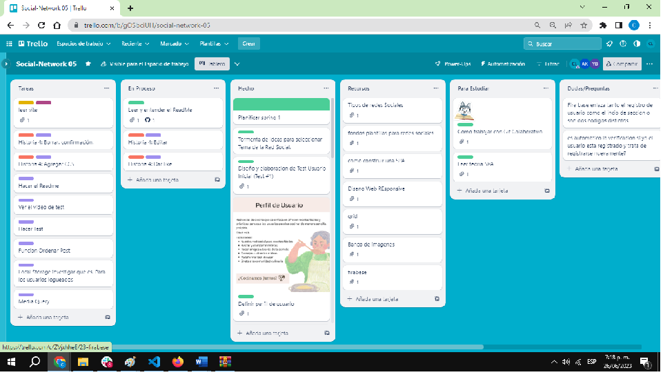
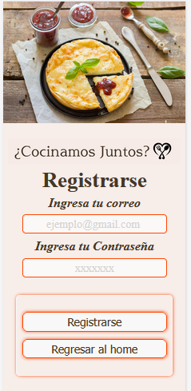

# ¿Cocinamos juntos? Social Network
## Índice
* [1. Resumen General](#1-Resumen-General)
* [2. Resumen del proyecto](#2-resumen-del-proyecto)
* [3. Recursos](#3-Recursos)
* [4. Descripción del Proyecto](#4-Descripcoó-del-proyecto)
* [5. Boilerplateo](#5-Boilerplate)
* [6. Objetivos de aprendisaje](#6-Objetivos-de-aprendisaje)
* [7. Nuestro equipo de trabajo](#7-Nuestro-equipo-de-trabajo)

## 1. Resumen General
En el presente corresponde al tercer proyecto del DEV007 del BootCamp Laboratoria, dónde se requiere construir una red social que una a una cominidad en torno a un interés en común.
El linea general el entregable es una red social de temática escogida por el equipo y solución evaluada a traves de test de usuarios dónde se pueda registrar, iniciar sesión, consultar las publicaciones, dar likes, publicar, borrar y editar.

## 2. Resumen del proyecto
Laboratoria propone construir una Red Social sobre la temática que decida el equipo.
La cual tendrá que permitir a cualquier usuario crear una cuenta de acceso
y loguearse con ella; crear, editar, borrar y _"likear"_ publicacciones.
Nuestro equipo a traves de la tecnica de tormenta de ideas seleccionó como tema principal de la Red Social
compartir recetas, con la intención de unir a personas de todas las edades a traves del amor por la comida, con la intensión de que la cocina puedes ser.

### Objetivos generales de este proyecto son los siguientes
* Desarrollar una SPA con temática de red social
* Aplicar los conceptos de responsividad en el desarrollo de las vistas (templates)
* Implementar un router para la navegación entre las diferentes vistas de la aplicación
* Emplear un servicio externo para la persistencia de datos de la aplicación
* Crear una suite de pruebas unitarias que permitan testear código asíncrono.

## 3. Recursos
* Software y aplicaciones web: Visual Studio Code (para generar el código), Canva (para realizar prototipo de alta fidelidad), GitHub(repositorio del proyecto), zoom (para comunicación con coachs y compañeras), Trello (para organizar las tareas de cada sprint del proyecto). Firebase/Firestore para alojar en ello la base de tados de la red social. Internet(para búsqueda de información y acceso a aplicaciones web)
* Hardware: PC de cada desarrollador.
* Tiempo: 80 horas cada intengrante del equipo aproximadamente incluyendo horas de OH e intercambio con compañeras. Estas horas incluye el tiempo de estudio e investigación.
Humano: 3 desarolladores. Colaboración adicional de acuerdo a las necesidades (coach, compañeras).

## 4. Descripción del Proyecto
El presente proyecto enmarca la realizacionde una Red Social cuyo propósito es unir a las personas interesadas en compartir recetas de cocina con personas interesadas en aprender a cocinar desde cualquier nivel de conocimiento. La ideas es crear una comunidad de intercambio para todo el que desee o necesite uan receta, promoviendo el intercambio de recetas, tips ideas que faciliten el proceso de quien desea realizar un determinado platillo y hacer amigos en torno a la gstronomia.
La intension principal es que todo usuario con interes en la cocina pueda sentirse a gusto en la comunidad sin importar su nivel de conocimiento o destresa. La idia principal es unir a la gente en torno a la gstromonia y poder crecer en comunidad.

*Planificacioón del Proyecto*
Toda la organizacion y seguimiento de las actividades se realizó a traves de la herramienta Trello, a continuacion compartimos el link:

https://trello.com/b/gOSbciUH/social-network-05

*Encuesta Incial a Ususarios*
Para llegar a este tema, se realizó una tormenta de ideas. Posterirmente, para darle forma a la red social se diseñó un cuestionario que nos ayudó a iniciar el proceso de diseño de los prototipo de baja y de alta. a continuacion presentamos los resultados de dicho cuestionario:

*Perfil de usuario*

*Guía de Diseño*

*Historias de Usuario y Prototipos:*

Prototipo de baja:

Prototipo de ALTA:
a continuacion compartimos el link al prototipo de alta realizado en Canva

https://cocinamosjuntos.my.canva.site/

seguidamente justificamos la razon del prototipo y cada historia de usuario.

*Logo*

El logo fue diseñado por el equipo de trabajo, y durante los test de usuarios recibió buenos comentarios. A continuacion presentamos las dos formas de uso de logo dentro de la aplicacion:

Logo en dispocición vertical:

Logo en disposición horizontal

MOBILE:
Historia 1: pantalla inicial en la cual se presenta la aplicacióny se tienen las obciones de resgitrarse, iniciar seccion en la red cocial, inlcuyendo la opcion de google que es amigable y muy apreciada por los usuarios.

Historia 2: esta historia de usuario le permitehcaer su registro en la red social con un correo y contraseña que escoja. dicha historia guía al usuario a traves de mensajes de error si los datos ingresados no son adecuados para hacer su registro.

Historia 3: una vez el usuario ya esta registrado, esta es la opción natural cada vez que desee ingresar a la red social. para lo cual tiene que ingresar el correo y contrasela con la que se registró. Igualmente si algun dato no coincide la aplicacion le generará un mensaje de error.

Historia 4: Esta historia incluye el corazon de la red social en ella estan las opciones de consultar e interactuar con las publicaciones sí como publicar.

Consulta de Publicaciones: el usuario puede leer las publicaciones de otros usuarios, puede dar like a las mismas.
Publicar: eauduario puede publicar su propia receta, editarla o borrarla si así lo desea.

DESKTOP

A continuacion una vista del diseño de alta para pantallas de computadoras de escritoio y lapto.

.

#### Desarrollo del Proyecto
El para el desarrollo del proyecto y siguiendo la guía enregada por laboratoria se diseñó First Mobile para luego hacerlo responsive a otros tamaños de pantalla.

#### Code Review.

El code review fue realizado en una sesión de una hora con el otro equipo de trabajo (equipo Social Network 16), de los cuales surgieron los siguientes comentarios:
- [X] Los imagenes se recomienda ir dentro de etiquetas como piture y figure y las Imagenes van dentro de un contenedor.
- [-] Los comentarios deberían de ir en Ingles. No fue incorporado ya que no todas manejamos el idioma.
- [X] Eliminar código invalidado
- [X] Eliminar console.log
- [X] Unificar el uso de comillas
- [X] Identación de cogido de HTLM que está dentro de JS
- [X] Incluir el reseteo de CCs: Normalize o  reset
- [X] Jerarquía en CCS es buena practica
- [X] Si toda la pagina tiene el mismo tipo de letra declarar en el body
- [X] Usar como medida de 100% máxima.
- [-] No usar bold. será tomando en cuenta en futuros proyectos.

#### Test de Usuarios.

#### Pruebas unitarias (unit tests)

Las pruebas unitarias contienen 15 test de funciones del código

## 5. Boilerplate

El boilerplate contiene una estructura de archivos:

.

Componets: contiene todo el código de cada una de las historias de usuarios. Las pantallas de:
   * Home.js: dónde se presenta la aplicacion al usuario, en ella puede decidir si ir a la pantalla inciciar sesión o a la de registrarse y como tercera opcion acceder directamente con google.
   * Resgiter.js: pantala para registro con correo y contraseña.
   * Login.js: pantalla para dar inicio de sesión e ingresar a la aplicación.
   * Posting.js: dónde se encuentra el corazón de la plicacion en ella puede el usuario consutar recetas puplicadas y dar likes. asi mismo puede publicar su propia receta, borrarla o editarla.

Firebase.js: contiene toda la logica de conexcion con el servicio de firebase y firestore que interactua con la funcionalidad de la aplicación.

Main.js: en la cual están todos los lonks o conexiones entre las distintas vistas SPA.

Index.HTLM:contiene el esqueleto general de la aplicación.

## 6. Objetivos de aprendizaje
Como parte del proceso de aprendizaje Laboratoria establece los siguientes items:
Reflexiona y luego marca los objetivos que has llegado a entender y aplicar en tu proyecto. Piensa en eso al decidir tu estrategia de trabajo.

### HTML
- [X] **Uso de HTML semántico**
### CSS
- [X] **Uso de selectores de CSS**
- [X] **Modelo de caja (box model): borde, margen, padding**
- [X] **Uso de flexbox en CSS**
- [X] **Uso de CSS Grid Layout**
### Web APIs
- [X] **Uso de selectores del DOM**
- [X] **Manejo de eventos del DOM (listeners, propagación, delegación)**
- [X] **Manipulación dinámica del DOM**
- [X] **Ruteado (History API, evento hashchange, window.location)**
### JavaScript
- [X] **Arrays (arreglos)**
- [X] **Objetos (key, value)**
- [X] **Diferenciar entre tipos de datos primitivos y no primitivos**
- [X] **Variables (declaración, asignación, ámbito)**
- [X] **Uso de condicionales (if-else, switch, operador ternario, lógica booleana)**
- [X] **Uso de bucles/ciclos (while, for, for..of)**
- [X] **Funciones (params, args, return)**
- [X] **Pruebas unitarias (unit tests)**
- [X] **Pruebas asíncronas**
- [X] **Uso de mocks y espías**
- [X] **Módulos de ECMAScript (ES Modules)**
- [X] **Uso de linter (ESLINT)**
- [X] **Uso de identificadores descriptivos (Nomenclatura y Semántica)**
- [X] **Diferenciar entre expresiones (expressions) y sentencias (statements)**
- [X] **Callbacks**
- [X] **Promesas**
### Control de Versiones (Git y GitHub)
- [X] **Git: Instalación y configuración**
- [X] **Git: Control de versiones con git (init, clone, add, commit, status, push, pull, remote)**
- [X] **Git: Integración de cambios entre ramas (branch, checkout, fetch, merge, reset, rebase, tag)**
- [X] **GitHub: Creación de cuenta y repos, configuración de llaves SSH**
- [X] **GitHub: Despliegue con GitHub Pages**
- [X] **GitHub: Colaboración en Github (branches | forks | pull requests | code review | tags)**
- [X] **GitHub: Organización en Github (projects | issues | labels | milestones | releases)**
### Centrado en el usuario
- [X] **Diseñar y desarrollar un producto o servicio poniendo a las usuarias en el centro**
### Diseño de producto
- [X] **Crear prototipos de alta fidelidad que incluyan interacciones**
- [X] **Seguir los principios básicos de diseño visual**
### Investigación
- [X] **Planear y ejecutar testeos de usabilidad de prototipos en distintos niveles de fidelidad**
### Firebase
- [X] **Firebase Auth**
- [X] **Firestore**

## 7. Nuestro equipo de trabajo
El presente proyecto fue desarrollado por:
* Analía Klein.
* Yohana Becerra.
* Carmen Luna.

La fuerza del equipo viene de cada miembro....